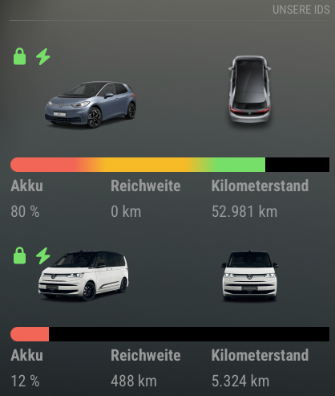

# MMM-weconnectid_MQTT

A [MagicMirror²](https://magicmirror.builders/) module that displays live vehicle data from **Volkswagen Group** cars (VW, Audi, SEAT, Škoda, Cupra) using the **EU Data Act portal** as data source.

Supports **pure electric vehicles** (ID.3, ID.4, ID.5, ID.7, e-Golf, …) and **plug-in hybrids** (Multivan, Golf GTE, …).

> **Why this module?**  
> Volkswagen shut down third-party access to the WeConnect API in 2024.  
> The EU Data Act portal is the official replacement for personal data access.  
> Data is delivered as ZIP files every ~15 minutes and is strictly read-only.

---

## Screenshot



---

## How it works

```
VW EU Data Act portal  (every 15 min)
        │
   vw_mqtt.py          (background service)
        │
   Mosquitto MQTT      (localhost:1883)
        │
   api.py              (called by node_helper.js)
        │
MMM-weconnectid_MQTT   (displayed on MagicMirror)
```

---

## Prerequisites

| Software | Install |
|---|---|
| MagicMirror² | https://magicmirror.builders/ |
| Python 3.9+ | replace `python3` with `python3.9` etc. if needed|
| Mosquitto MQTT broker | `sudo apt install mosquitto mosquitto-clients` |
| paho-mqtt | `sudo pip3 install paho-mqtt --break-system-packages` |
| CarConnectivity connector | see below |

---

## Installation

### Step 1 – Activate the VW EU Data Act portal

1. Open https://eu-data-act.drivesomethinggreater.com in a browser.
2. Log in with your **Volkswagen ID** (same credentials as the VW app).
3. Go to **Data clusters → Vehicle overview → Get customised data**.
4. Select **continuous data, 15-minute interval**.
5. Wait 15–30 minutes until the first ZIP file appears.

> ⚠️ This step must be done **manually** for each VW account. It is a one-time setup.

### Step 2 – Install the Python connector

First check which Python version you will use:
```bash
python3 --version
# or if you plan to use python3.9:
python3.9 --version
```

Install the connector for **that exact Python version** (replace `python3` with `python3.9` etc. if needed):

```bash
sudo python3 -m pip install --no-deps --break-system-packages carconnectivity
sudo python3 -m pip install --no-deps --break-system-packages \
    git+https://github.com/mikrohard/CarConnectivity-connector-vw-eu-data-act.git
sudo python3 -m pip install --break-system-packages paho-mqtt
```

> ⚠️ The Python version used here **must match** the `python` setting in `config.js`.  
> Example: if you set `python: "python3.9"` in config.js, install with `sudo python3.9 -m pip install ...`

Verify:
```bash
python3 -c "from carconnectivity_connectors.vw_eu_data_act.client import EudaApiClient; print('OK')"
```

### Step 3 – Install Mosquitto

```bash
sudo apt install mosquitto mosquitto-clients -y
sudo systemctl enable mosquitto
sudo systemctl start mosquitto
```

### Step 4 – Clone this module

```bash
cd ~/MagicMirror/modules
git clone https://github.com/YOUR_USERNAME/MMM-weconnectid_MQTT.git
```

### Step 5 – Configure vw_mqtt.py

Edit `vw_mqtt.py` and fill in your vehicles in the `CARS` list:

```python
CARS = [
    {
        "email":      "your@email.com",      # VW account e-mail
        "password":   "yourpassword",         # VW account password
        "vin":        "WVWZZZE1ZNP000000",    # Vehicle VIN (see registration document)
        "identifier": "",                     # Leave empty – fetched automatically
        "topic":      "vwdata/mycar",         # MQTT topic – must match config.js
        "type":       "electric",             # "electric" or "hybrid"
    },
]
```

> **Finding your VIN:** It is printed on the vehicle registration document (field E) and on the dashboard visible through the windscreen.

### Step 6 – Test vw_mqtt.py

```bash
python3 ~/MagicMirror/modules/MMM-weconnectid_MQTT/vw_mqtt.py
```

You should see output like:
```
INFO [WVWZZZE1ZNP000000] Downloading 20260808132701_WVWZZZE1ZNP000000.zip...
INFO   vwdata/mycar/soc = 80
INFO   vwdata/mycar/odometer = 50313
...
```

Verify MQTT data:
```bash
mosquitto_sub -h localhost -t "vwdata/#" -v
```

### Step 7 – Install as a systemd service (autostart)

This makes `vw_mqtt.py` start automatically every time the Raspberry Pi boots.

**7a – Find out your username and Python path:**
```bash
whoami
which python3
```
Example output: `chris` and `/usr/bin/python3`

**7b – Copy the service file:**
```bash
sudo cp ~/MagicMirror/modules/MMM-weconnectid_MQTT/vw_mqtt.service \
        /etc/systemd/system/vw_mqtt.service
```

**7c – Edit the service file** and replace the three placeholder values:
```bash
sudo nano /etc/systemd/system/vw_mqtt.service
```

Change these lines (use the values from step 7a):
```ini
User=chris
WorkingDirectory=/home/chris/MagicMirror/modules/MMM-weconnectid_MQTT
ExecStart=/usr/bin/python3 /home/chris/MagicMirror/modules/MMM-weconnectid_MQTT/vw_mqtt.py
```
(replace `python3` with `python3.9` etc. if needed)

Save with `Ctrl+O`, `Enter`, `Ctrl+X`.

**7d – Enable and start the service:**
```bash
sudo systemctl daemon-reload
sudo systemctl enable vw_mqtt
sudo systemctl start vw_mqtt
sudo systemctl status vw_mqtt
```

You should see `active (running)` in the status output.

**7e – Check the live logs** to confirm data is being fetched:
```bash
sudo journalctl -u vw_mqtt -f
```

You should see lines like `vwdata/mycar/soc = 80`. Press `Ctrl+C` to exit.

### Step 8 – Add the module to config.js

```javascript
{
    module: 'MMM-weconnectid_MQTT',
    header: "My Car",
    position: "bottom_right",
    config: {
        username: "vwdata/mycar",       // MQTT topic – must match vw_mqtt.py
        vin: "WVWZZZE1ZNP000000",       // for display only
        fields: '{"SOC":"remainingSoC","Updated":"timestamp","Mileage":"odometer","Charge time":"remainingTime","Target SOC":"targetSoC","Power":"chargePower","km/h":"chargekmph"}',
        fields_charging: ["Charge time", "Target SOC", "Power", "km/h"],
        number: 4,
        python: "python3",                //replace python3 with python3.9 etc. if needed
        maxHeight: "200px",
        maxWidth: "400px",
        remainingSOCyellow: 60,
        remainingSOCred: 25,
        barstyle: "strict",
        updateFrequency: 15 * 60 * 1000,
        timestamp: false,
    }
},
```

> **Multiple vehicles:** Add one module block per vehicle, each with a different `username` (= MQTT topic).

---

## Configuration options

| Option | Description | Default |
|---|---|---|
| `username` | MQTT topic prefix (e.g. `vwdata/mycar`) | `vwdata/mycar` |
| `vin` | Vehicle VIN – for display purposes only | `""` |
| `fields` | JSON string defining which fields to display | see above |
| `fields_charging` | Fields shown only when charging | `["LOADING TIME","TARGET SOC","LOADING POWER","KMPH"]` |
| `number` | Number of columns in the data table | `4` |
| `python` | Python executable (`python3`, `python3.9`, …) | `python3` |
| `maxHeight` | Maximum height of the module | `300px` |
| `maxWidth` | Maximum width of the module | `800px` |
| `remainingSOCyellow` | SoC threshold for yellow warning | `70` |
| `remainingSOCred` | SoC threshold for red warning | `20` |
| `barstyle` | Battery bar style: `fluent` or `strict` | `fluent` |
| `updateFrequency` | Update interval in milliseconds | `900000` (15 min) |
| `timestamp` | Always show data timestamp below module | `false` |

### Available field keys

| Key | Description |
|---|---|
| `remainingSoC` | Battery state of charge (%) |
| `remainingKm` | Remaining range (km) |
| `electricRange` | Electric range (km) – hybrid only |
| `gasolineRange` | Fuel range (km) – hybrid only |
| `odometer` | Total mileage (km) |
| `chargingState` | Charging status |
| `chargePower` | Charging power (kW) |
| `targetSoC` | Target charge level (%) |
| `remainingTime` | Remaining charge time (HH:MM) |
| `chargekmph` | Charge speed (km/h range added) |
| `fuelLevel` | Fuel tank level (%) – hybrid only |
| `outdoorTemp` | Outdoor temperature (°C) |
| `timestamp` | Timestamp of last vehicle data |
| `position` | Last known position |

---

## Vehicle images

Place two PNG files in:
```
modules/MMM-weconnectid_MQTT/Pictures/<module-identifier>/
    car.png      – side view of your vehicle
    status.png   – charging/status overlay image
```

The `<module-identifier>` is printed in the MagicMirror developer console when the module starts.

---

## Troubleshooting

**Module shows "Loading..."**  
→ Check if `vw_mqtt.py` is running: `sudo systemctl status vw_mqtt`  
→ Check MQTT data: `mosquitto_sub -h localhost -t "vwdata/#" -v`

**Data is not updating**  
→ The VW EU Data Act portal only delivers data when the vehicle is active (driving or charging). Parked vehicles may not receive updates for hours.  
→ Check the portal: https://eu-data-act.drivesomethinggreater.com – new ZIP files should appear every ~15 minutes when the car is active.

**HTTP 500 errors from VW portal**  
→ The portal occasionally has outages. `vw_mqtt.py` retries automatically every 15 minutes.

**Wrong Python version**  
→ Set `python: "python3.9"` (or whichever version has the dependencies installed) in `config.js`.

---

## Based on

- Original module: [MMM-weconnectid](https://github.com/NikolasRupp/MMM-weconnectid) by NikolasRupp  
- EU Data Act connector: [CarConnectivity-connector-vw-eu-data-act](https://github.com/mikrohard/CarConnectivity-connector-vw-eu-data-act) by mikrohard

---

## License

MIT
